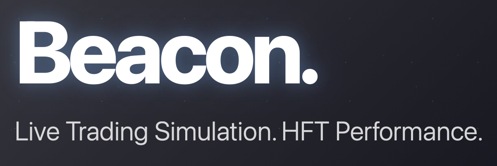
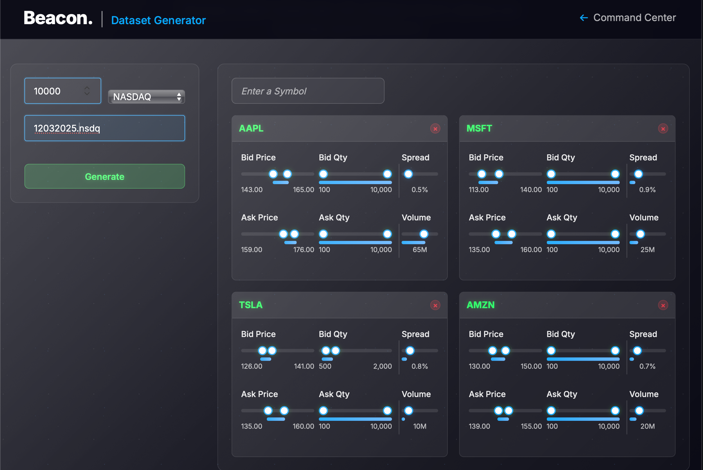

# Beacon Trading System
Wondering how your trading strategy perform in the ***real*** market place? Have an estimate in minutes.Beacon offers true live simulation. Native, binary exchange protocols used throughout.Create tailored datasets. Play them to your algorithm via **UDP**. Take advantage of the 3-tier risk management system. Execute against a matching engine via **TCP** that provides comprehensive feedback. Take into account where your strategy is **co-located**. NASDAQ, NYSE, and CME exchanges are supported. See the full picture!

## Beacon's Core Components
- <span style="color:cornflowerblue">**Dataset Generator:**</span>
- <span style="color:cornflowerblue">**Dataset Playback:**</span>
- <span style="color:cornflowerblue">**Client Algorithm:**</span>
- <span style="color:cornflowerblue">**Matching Enging:**</span>


## Synthetic Market Data

Beacon’s dataset generator is designed for professional quant and HFT users who demand realistic, production-grade simulation. Datasets are created using a hybrid approach:

- **Wave and Burst Simulation:** Configurable cycles, bursts, and volatility spikes per product, not just simple sine waves.
- **Statistical Modeling:** Random walks, volatility clustering, and jump diffusion for baseline price and volume.
- **Order Book Microstructure:** Simulated order arrivals, cancellations, and executions for realistic limit order book dynamics.
- **Event-Driven Scenarios:** Inject macro events, news-driven volatility, and correlated moves across products.
- **Parameter Diversity:** Each product can be independently configured for spread, volume, trading frequency, and more.
- **Microstructure Noise:** Out-of-order messages, missing packets, and exchange quirks for robust algorithm stress-testing.

No historical data is required—Beacon uses domain knowledge and best practices from institutional trading to mimic real-world market behavior. This ensures your strategies are tested against a wide range of realistic scenarios, not just idealized or toy models.

## Creating Customized Datasets.
- Configure your own market datasets. Use smart defaults or tailor on a granular level. 

Enter as many products as you want. Configure each product's ***bid-ask spread***, ***volume***, ***bid/ask prices*** with a weighting system, the percent of messaegs per product in the data set,
the ***product's trading*** frequency, and much, much more.
- You pick the exchange, and your dataset will be generated into ***native binary protocol***, per each exchange's specifications.
- Create as many datasets as you'd like, specify whatever parameters you'd like.


## Market Data Exchange
Beacon comes with a world-class component called "Market Data Playback". This acts as a true market data exchange. It broadcasts the dataset ***you created*** to your algorithm via UDP (loopback). Just as an exchange would. No market data **ever** leaves your trading machine. **No networking** is involved. But your algorithm receives all the benefits of interacting with a true exchange, sending your data in exchange-specific binary protocol.
- Play your data back in configurable burst and wave intervals.
- Play your data back at different speeds. Stress test your algorithm in real-time.
- Make the exchange "go dark", send you malformed, out of order, or missing packets, so you can prepare for disaster-recovery scenarios.

## Client Algorithm
**Real Exchange Protocols** - Native binary NASDAQ NYSE, and CME used throughout  
**World-Class Infrastructure** - Lock-free, cache-aware, zero-copying.
**Production Architecture** - Matching engine, order book simulation, multi-threaded market data processing  
**Institutional Features** - Risk limits, position tracking, real-time P&L, execution analytics

## Plug-In Algorithm Development

Build sophisticated trading strategies with the framework:

```cpp
class YourStrategy : public AlgorithmBase {
    void onMarketData(const MarketUpdate& update) override {
        // Your trading logic here
        //if (shouldTrade(update)) {
        //    sendOrder(OrderType::LIMIT, 100, update.bid + 0.01);
        //}
    }

    void onOrderAck(const MarketOrder& order) override {
    }

    void onOrderReject(const MarketReject& reject) override {
    }    

    void onOrderFill(const ExecutionReport& fill) override {
        //updatePosition(fill);
    }
};
```

**Included Strategies:**
- **TWAP** - A true Time-weighted average price execution.
- **POV**  - A minimal copy/paste example.

## Contact

**Bryan Camp**  
Email: [bryancamp@gmail.com]  
LinkedIn: [linkedin.com/in/bryanlcamp]