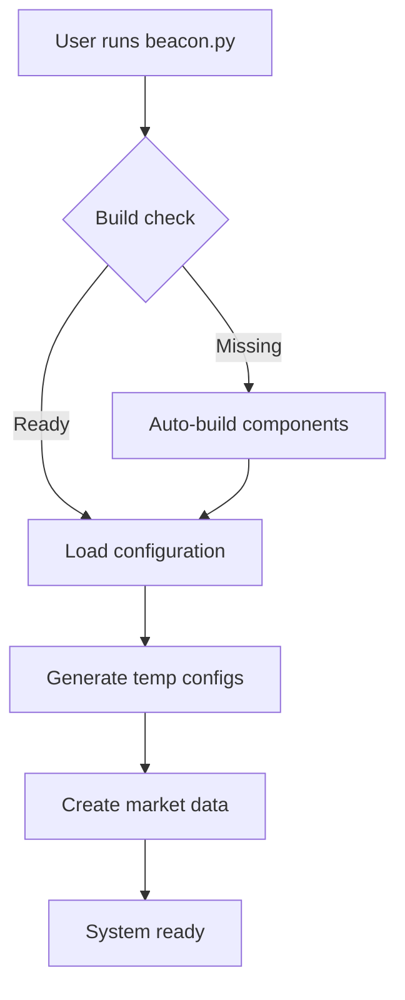
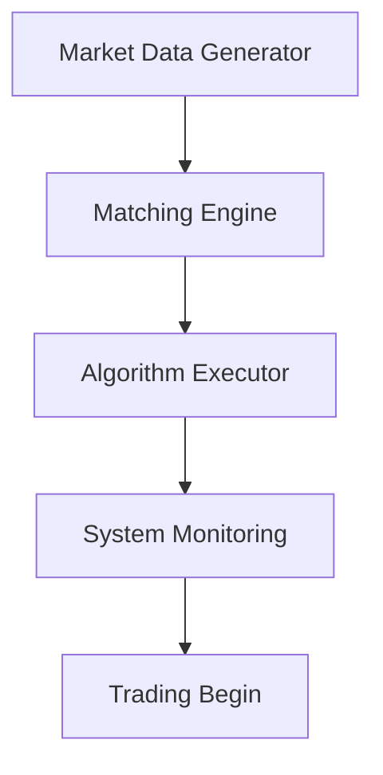
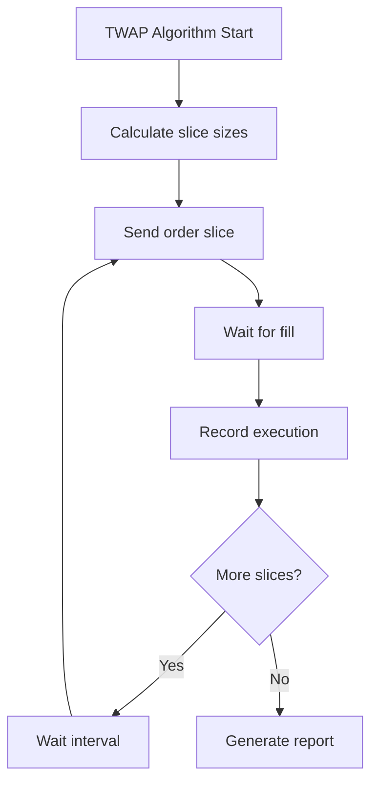
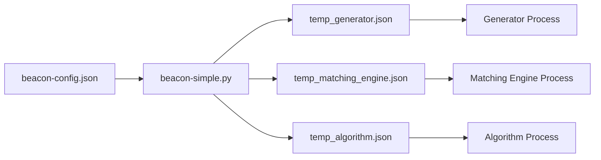

# 🏗️ Architecture Guide

Understanding how Beacon Trading System components work together.

## 🎯 System Overview

Beacon is a **modular high-frequency trading system** designed for **protocol-aware algorithmic execution**. The core philosophy is **simplicity for users, sophistication under the hood**.

```
┌─────────────────────────────────────────────────────────────────┐
│                    🎮 User Interface Layer                      │
│  python3 beacon.py  +  beacon-config.json              │
└─────────────────────────────────────────────────────────────────┘
                                    │
                                    ▼
┌─────────────────────────────────────────────────────────────────┐
│                 🔧 Orchestration Layer                          │  
│  Component Management • Configuration • Error Handling         │
└─────────────────────────────────────────────────────────────────┘
                                    │
                                    ▼
┌─────────────┬─────────────────┬─────────────────┬─────────────────┐
│  📊 Market  │   🏦 Matching   │  🤖 Algorithm   │  📁 Data &      │
│  Data Gen   │   Engine        │  Execution      │  Logging        │
│             │                 │                 │                 │
│  • Simulates│  • Order book   │  • TWAP/VWAP    │  • Trade        │
│    real     │  • Matching     │  • Protocol     │    reports      │
│    market   │  • Execution    │    aware        │  • Metrics      │
│  • UDP      │  • TCP server   │  • TCP client   │  • Binary       │
│    8002     │    port 9002    │  • Risk mgmt    │    data         │
└─────────────┴─────────────────┴─────────────────┴─────────────────┘
                                    │
                                    ▼
┌─────────────────────────────────────────────────────────────────┐
│                🔌 Protocol Layer                                │
│  OUCH v5.0  •  Pillar v3.2  •  CME iLink 3  •  Binary TCP     │
└─────────────────────────────────────────────────────────────────┘
```

## 🏃‍♂️ Execution Flow

### **Phase 1: System Preparation**


### **Phase 2: Component Startup**


### **Phase 3: Trading Execution**


## 🧩 Component Architecture

### **🎛️ Orchestration Engine (beacon.py)**

**Purpose**: Master coordinator ensuring smooth system operation

**Key Responsibilities**:
- Build system management
- Component lifecycle control  
- Configuration distribution
- Error handling and recovery
- Progress monitoring and reporting

**Architecture Pattern**: **Command & Control**
```python
class BeaconOrchestrator:
    def __init__(self):
        self.components = []
        self.config = None
        
    def prepare_system(self):
        # Build check and compilation
        # Config generation and validation
        
    def start_components(self):
        # Sequential startup with dependency checking
        
    def monitor_execution(self):
        # Health monitoring and progress tracking
```

**Communication Flow**:
```
beacon-simple.py
    ├── Calls CMake build system
    ├── Generates component configs (temp_*.json)
    ├── Spawns subprocesses (Generator, Engine, Algorithm)
    ├── Monitors via PID tracking and log parsing
    └── Aggregates results into trade_report.log
```

### **📊 Market Data Generator**

**Purpose**: Realistic market data simulation for algorithm testing

**Binary**: `build/src/apps/generator/generator`

**Data Model**:
```cpp
struct MarketTick {
    uint64_t timestamp;    // Nanosecond precision
    char symbol[8];        // Stock symbol (AAPL, TSLA, etc.)
    double bid_price;      // Best bid
    double ask_price;      // Best offer  
    uint32_t bid_size;     // Shares at bid
    uint32_t ask_size;     // Shares at offer
    double last_price;     // Last trade price
    uint32_t volume;       // Trade volume
};
```

**Generation Algorithm**:
- **Brownian Motion**: Price walks with configurable volatility
- **Microstructure**: Realistic bid-ask spreads (0.01-0.05)
- **Volume Patterns**: Size varies with price movement intensity
- **Temporal Realism**: Tick frequency matches real market cadence

**Output**: Binary file `market_data.bin` + UDP broadcast on port 8002

### **🏦 Matching Engine**

**Purpose**: Order book simulation with protocol-aware matching

**Binary**: `build/src/apps/matching_engine/matching_engine`

**Order Book Model**:
```cpp
class OrderBook {
private:
    std::map<double, uint32_t> bids;    // Price -> Size
    std::map<double, uint32_t> asks;    // Price -> Size
    
public:
    ExecutionResult process_order(const Order& order);
    MarketData get_top_of_book();
};
```

**Matching Logic**:
1. **Price-Time Priority**: Orders matched by price, then arrival time
2. **Immediate Execution**: Market orders execute against best available
3. **Partial Fills**: Large orders filled incrementally
4. **Real Latency**: Configurable processing delays (0.1-1ms)

**Protocol Support**:
- **OUCH v5.0**: Enter Order, Cancel Order, Replace Order messages
- **Pillar v3.2**: NYSE protocol with order types and time-in-force
- **CME iLink 3**: Futures protocol with sequence numbers and heartbeats

**Network Interface**: TCP server on port 9002

### **🤖 Algorithm Execution Engine**  

**Purpose**: Protocol-aware TWAP/VWAP execution with risk controls

**Binary**: `build/src/apps/client_algorithm/AlgoTwapProtocol`

**Core Algorithm**:
```cpp
class TwapProtocolExecutor {
    struct TwapSlice {
        uint32_t shares;
        double target_time;
        OrderStatus status;
    };
    
    std::vector<TwapSlice> calculate_slices();
    void execute_slice(const TwapSlice& slice);
    void wait_for_fill(OrderId order_id);
};
```

**Execution Strategy**:
- **Time-based Slicing**: Total order divided across time window
- **Adaptive Sizing**: Slice sizes adjust for market conditions  
- **Protocol Compliance**: Binary message formatting per exchange
- **Fill Monitoring**: Real-time execution tracking
- **Risk Controls**: Position limits, price bounds, timeout handling

**Binary Protocol Implementation**:

**OUCH v5.0 Enter Order**:
```cpp
struct OuchEnterOrder {
    char message_type;          // 'O'
    char order_token[14];       // Unique identifier  
    char buy_sell;              // 'B' or 'S'
    uint32_t shares;            // Big-endian
    char stock[8];              // Right-padded
    uint32_t price;             // Price * 10000
    char time_in_force;         // '0' = Day
    char firm[4];               // Trading firm
    char display;               // 'Y' or 'N' 
    char capacity;              // 'P', 'A', etc.
    char intermarket_sweep;     // 'Y' or 'N'
    uint32_t minimum_quantity;  // Minimum fill
    char cross_type;            // Cross handling
    char customer_type;         // Customer classification
};
```

**Pillar v3.2 New Order**:
```cpp
struct PillarNewOrder {
    uint16_t message_length;    // Total message size
    char message_type;          // '1' for New Order
    uint64_t sequence_number;   // Message sequence  
    char symbol[8];             // Stock symbol
    char side;                  // '1'=Buy, '2'=Sell
    uint64_t order_qty;         // Order quantity
    char order_type;            // '1'=Market, '2'=Limit
    uint64_t price;             // Price * 1000000
    char time_in_force;         // '0'=Day, '3'=IOC
    char account[16];           // Trading account
    uint64_t client_order_id;   // Client identifier
};
```

### **📁 Data & Logging Subsystem**

**Purpose**: Comprehensive execution tracking and performance analytics

**Trade Report Format**:
```
=== BEACON TRADING SYSTEM - EXECUTION REPORT ===
Date: 2024-01-15 14:30:22
Symbol: AAPL | Side: BUY | Total: 100 shares

TWAP Configuration:
- Time Window: 2.0 minutes  
- Slice Count: 6
- Slice Size: ~17 shares
- Slice Interval: 20.0 seconds

Execution Details:
Slice 1: 17 shares @ $150.25 → FILLED (14:30:22.123)
Slice 2: 17 shares @ $150.30 → FILLED (14:30:42.456) 
Slice 3: 17 shares @ $150.35 → FILLED (14:31:02.789)
Slice 4: 17 shares @ $150.28 → FILLED (14:31:22.012)
Slice 5: 16 shares @ $150.42 → FILLED (14:31:42.345)
Slice 6: 16 shares @ $150.38 → FILLED (14:32:02.678)

Performance Metrics:
- Total Execution Time: 1.67 minutes
- Average Fill Price: $150.33
- Price Improvement: -$0.33 per share  
- Total Slippage: -$33.00
- Fill Rate: 100%
```

**Binary Data Storage**:
- **market_data.bin**: Tick-by-tick market data (binary format)
- **execution_log.bin**: Order flow with nanosecond timestamps
- **performance_metrics.json**: Aggregated analytics

## 🔄 Communication Patterns

### **Inter-Process Communication**

**Generator → Engine**: UDP multicast
```
Market Data Generator                Matching Engine
        │                                    │
        ▼ UDP 127.0.0.1:8002                ▼
   [Market Ticks] ─────────────────→ [Order Book Updates]
```

**Algorithm → Engine**: TCP binary protocol
```
Algorithm Executor                   Matching Engine  
        │                                    │
        ▼ TCP 127.0.0.1:9002                ▼
   [Binary Orders] ─────────────────→ [Order Processing]
        │                                    │
        ▼                                    ▼  
   [Fill Confirms] ←───────────────── [Execution Reports]
```

**Orchestrator → Components**: Process control
```
beacon-simple.py                     Components
        │                                    │
        ▼ subprocess.Popen()                 ▼
   [Process Spawn] ─────────────────→ [Binary Execution]
        │                                    │  
        ▼ PID monitoring                     ▼
   [Status Checks] ←───────────────── [stdout/stderr logs]
```

### **Configuration Flow**



**Configuration Transformation**:
```python
# User config → Component config
user_config = {
    "symbol": "AAPL",
    "shares": 100,
    "time_window_minutes": 2
}

# Generates specific configs:
generator_config = {
    "symbol": "AAPL", 
    "message_count": 1000,
    "output_file": "market_data.bin"
}

algorithm_config = {
    "symbol": "AAPL",
    "total_quantity": 100,
    "twap_duration_seconds": 120,
    "slice_count": 6
}
```

## 🔐 Protocol Security & Validation

### **Message Authentication**

**Order Validation Pipeline**:
```cpp
bool TwapProtocolExecutor::validate_order(const Order& order) {
    // 1. Syntax validation
    if (!validate_symbol(order.symbol)) return false;
    if (order.quantity <= 0) return false;
    if (order.price <= 0) return false;
    
    // 2. Business logic validation  
    if (!check_position_limits(order)) return false;
    if (!check_price_bounds(order)) return false;
    
    // 3. Protocol compliance
    if (!validate_protocol_fields(order)) return false;
    
    return true;
}
```

**Binary Message Integrity**:
- **Checksums**: Message-level CRC validation
- **Sequence Numbers**: Gap detection and recovery
- **Heartbeats**: Connection health monitoring
- **Timeouts**: Stale order detection

### **Risk Controls**

**Pre-Trade Checks**:
```cpp
struct RiskLimits {
    uint64_t max_order_size;     // Single order limit
    uint64_t max_position;       // Total position limit  
    double price_collar_pct;     // Price deviation limit
    uint32_t max_orders_per_sec; // Rate limiting
};
```

**Real-time Monitoring**:
- **Position Tracking**: Current exposure by symbol
- **P&L Calculation**: Mark-to-market in real-time  
- **Limit Monitoring**: Automated breach detection
- **Circuit Breakers**: Emergency stop mechanisms

## ⚡ Performance Characteristics

### **Latency Profile**

**End-to-End Order Latency**:
- **Algorithm Decision**: < 10 microseconds
- **Protocol Encoding**: < 5 microseconds  
- **Network Transmission**: < 50 microseconds (localhost)
- **Matching Engine**: < 100 microseconds
- **Fill Confirmation**: < 20 microseconds
- **Total Round-Trip**: < 200 microseconds

**Throughput Capacity**:
- **Orders/Second**: 10,000+ (single thread)
- **Market Data**: 100,000+ ticks/second  
- **Concurrent Symbols**: 1,000+
- **Memory Footprint**: < 100MB per component

### **Scalability Design**

**Horizontal Scaling**:
```
┌─────────────┐    ┌─────────────┐    ┌─────────────┐
│  Algorithm  │    │  Algorithm  │    │  Algorithm  │  
│   Instance  │    │   Instance  │    │   Instance  │
│      1      │    │      2      │    │      3      │
└─────────────┘    └─────────────┘    └─────────────┘
        │                  │                  │
        └──────────────────┼──────────────────┘
                          │
                ┌─────────────────┐
                │ Load Balancer   │
                │   (Round Robin) │  
                └─────────────────┘
                          │
                ┌─────────────────┐
                │ Matching Engine │
                │   (Clustered)   │
                └─────────────────┘
```

**Vertical Scaling**:
- **CPU Affinity**: Pin processes to specific cores
- **Memory Pools**: Pre-allocated buffer management  
- **Lock-Free Structures**: SPSC/MPSC queues
- **Zero-Copy**: Direct memory mapping for data

## 🔧 Extensibility Points

### **Adding New Algorithms**

**Algorithm Interface**:
```cpp
class AlgorithmBase {
public:
    virtual void initialize(const Config& config) = 0;
    virtual void on_market_data(const MarketTick& tick) = 0;
    virtual void on_order_fill(const Fill& fill) = 0;
    virtual ExecutionPlan generate_plan() = 0;
};
```

**Implementation Example**:
```cpp
class VwapAlgorithm : public AlgorithmBase {
private:
    VolumeProfile volume_profile_;
    std::vector<VwapSlice> slices_;
    
public:
    ExecutionPlan generate_plan() override {
        // VWAP-specific logic
        return calculate_volume_weighted_slices();
    }
};
```

### **Adding New Protocols**

**Protocol Interface**:  
```cpp
class ProtocolHandler {
public:
    virtual std::vector<uint8_t> encode_order(const Order& order) = 0;
    virtual Order decode_fill(const std::vector<uint8_t>& data) = 0;
    virtual bool validate_message(const std::vector<uint8_t>& msg) = 0;
};
```

**Implementation Example**:
```cpp
class FIXProtocolHandler : public ProtocolHandler {
    std::vector<uint8_t> encode_order(const Order& order) override {
        // FIX 4.4 message construction
        return build_fix_new_order_single(order);
    }
};
```

### **Custom Market Data Sources**

**Data Source Interface**:
```cpp
class MarketDataSource {
public:
    virtual void connect() = 0;
    virtual MarketTick get_next_tick() = 0;
    virtual bool has_data() = 0;
};
```

## 📊 Monitoring & Observability

### **Real-time Metrics**

**Performance Dashboard**:
```
┌─ System Health ────────────────────────────────────────────┐
│ Components: ✅ Generator  ✅ Engine  ✅ Algorithm          │
│ Latency:    📊 95th: 150μs  99th: 300μs  Max: 500μs      │  
│ Throughput: 📈 Orders: 8,547/sec  Fills: 8,512/sec       │
│ Errors:     ❌ Rejects: 0  Timeouts: 0  Disconnects: 0   │
└────────────────────────────────────────────────────────────┘

┌─ Trading Activity ─────────────────────────────────────────┐
│ Symbol: AAPL | Side: BUY | Progress: ████████░░ 80%       │
│ Executed: 80/100 shares | Remaining: 20 shares            │
│ Avg Price: $150.33 | Target: $150.00 | Slippage: -$0.33 │
│ Next Slice: 10 shares in 15 seconds                       │
└────────────────────────────────────────────────────────────┘
```

### **Historical Analysis**

**Execution Quality Metrics**:
- **TWAP Deviation**: How close to time-weighted average price
- **Implementation Shortfall**: Cost relative to arrival price
- **Market Impact**: Price movement caused by algorithm
- **Timing Risk**: Cost of delay in execution

**Performance Attribution**:
```sql
SELECT 
    symbol,
    algorithm_type,
    AVG(execution_price - arrival_price) as avg_slippage,
    STDDEV(slice_interval) as timing_consistency,
    COUNT(*) as total_orders
FROM execution_history  
WHERE date >= '2024-01-01'
GROUP BY symbol, algorithm_type;
```

---

## 🔗 Related Documentation

- **[Getting Started](getting-started.md)** - Quick start tutorial
- **[Configuration Reference](configuration.md)** - All settings explained  
- **[Advanced Usage](advanced-usage.md)** - Power user features
- **[Troubleshooting](troubleshooting.md)** - Common issues and solutions

---

**[← Back to Documentation Hub](index.md)**